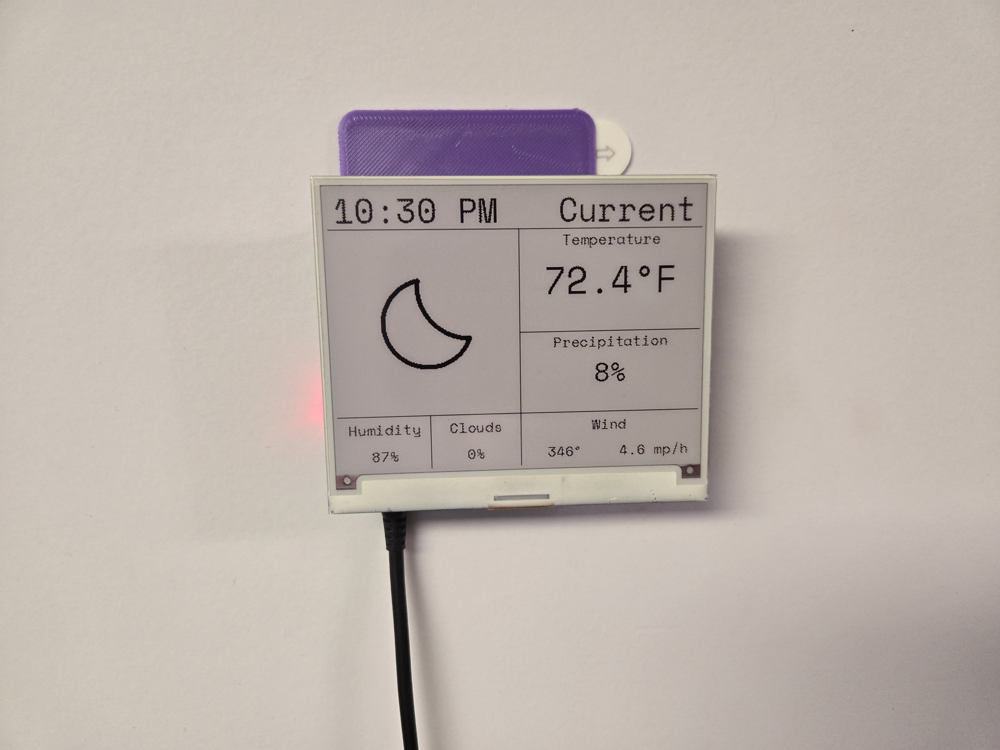
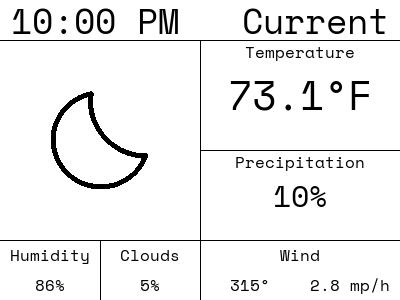
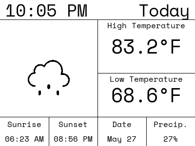
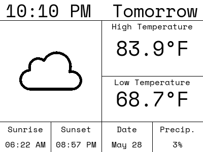

# WeatherPaper

A Python project that utilizes a Raspberry Pi and an E-Paper display to create a wall mounted weather dashboard.

---

## The Finished Project



---

## Sample Forecasts

WeatherPaper generates three display views, each sized for the 400×300 InkyWHAT screen.

### Current Weather


### Today's Forecast


### Tomorrow's Forecast


---

## How It Works

1. **`FileManagement.py`** 
   * Fetches a weather forecast from the [Open-Meteo API](https://open-meteo.com/) and caches it locally.
   * Automatically checks the age the most recent cached forecast, only making another API request after 15-minues have elapsed.
     * This is to prevent excessive API calls during testing.
   * Provides access to the cached forecast to the rest of the project.
2. **`WeatherData.py`**
   * Wraps the raw JSON response and exposes clean accessor methods for temperatures, precipitation, wind, sunrise/sunset, and more.
3. **`GeneratePNGs.py`** 
   * Uses [Pillow](https://pillow.readthedocs.io/en/stable/) to render three PNG images — current conditions, today's forecast, and tomorrow's forecast.
   * Saves these images for later shell script access.
4. **`PushImage.py`** 
   * Takes one of the generated PNG forecasts ( via command line argument ) and pushes it to the display.

---

## Requirements

- Raspberry Pi (any model with GPIO)
- [Pimoroni InkyWHAT](https://shop.pimoroni.com/products/inky-what) e-paper display (400×300, red/black/white)
- Python 3.8+

Install Python dependencies:

```bash
pip install -r requirements.txt
```

---

## Setup

1. Clone the repository:
   ```bash
   git clone https://github.com/your-username/WeatherPaper.git
   cd WeatherPaper
   ```

2. Copy the example secrets file and fill in your coordinates:
   ```bash
   cp fake-secrets.ini secrets.ini
   ```

   Edit `secrets.ini`:
   ```ini
   [Location]
   lat = YOUR_LATITUDE
   lon = YOUR_LONGITUDE
   ```

3. Create the output directories if they don't exist:
   ```bash
   mkdir -p PNGs forecast
   ```

---

## Usage

### Generate forecast PNGs

```bash
python GeneratePNGs.py
```

This will create `PNGs/current.png`, `PNGs/today.png`, and `PNGs/tomorrow.png`.

### Push a PNG to the display

```bash
python PushImage.py PNGs/current.png
```

### Use the shell scripts

Convenience scripts are included for each view:

```bash
./push_current.sh
./push_today.sh
./push_tomorrow.sh
```

---

## Automating with cron

To refresh the display automatically, add entries to your crontab with `crontab -e`:

```cron
# For each, >> ~/cronlog.txt 2>&1 will append the logs generated py the automated system to a log file
# Generates a new set of forecast PNGs every hour at minute 0, 15, 30, and 45
0,15,30,45 * * * * <path-to-WeatherPaper>/WeatherPaper/generate_reports.sh >> ~/cronlog.txt 2>&1

# Pushes the current weather forecast to the display every hour at minute 1, 16, 31, and 46
1,16,31,46 * * * * <path-to-WeatherPaper>/WeatherPaper/push_current.sh >> ~/cronlog.txt 2>&1

# Pushes today's weather forecast to the display every hour at minute 5, 20, 35, and 50
5,20,35,50 * * * * <path-to-WeatherPaper>/WeatherPaper/push_today.sh >> ~/cronlog.txt 2>&1

# Pushes tomorrow's weather forecast to the display every hour at minute 10, 25, 40, and 55
10,25,40,55 * * * * <path-to-WeatherPaper>/WeatherPaper/push_tomorrow.sh >> ~/cronlog.txt 2>&1
```

---

## Project Structure

```
WeatherPaper/
├── FileManagement.py   # API fetching and forecast caching
├── WeatherData.py      # Data accessor class for the JSON forecast
├── GeneratePNGs.py     # Pillow-based PNG rendering
├── PushImage.py        # Sends a PNG to the InkyWHAT display
├── PyLog.py            # Simple logging utility
├── Secrets.py          # Reads coordinates from secrets.ini
├── fonts/              # TTF font used for rendering
├── icons/              # Weather condition icons (PNG)
├── PNGs/               # Generated forecast images (output)
├── forecast/           # Cached API response (output)
├── requirements.txt
└── fake-secrets.ini    # Template — copy to secrets.ini and fill in
```

---

## License

MIT — see [LICENSE](LICENSE)